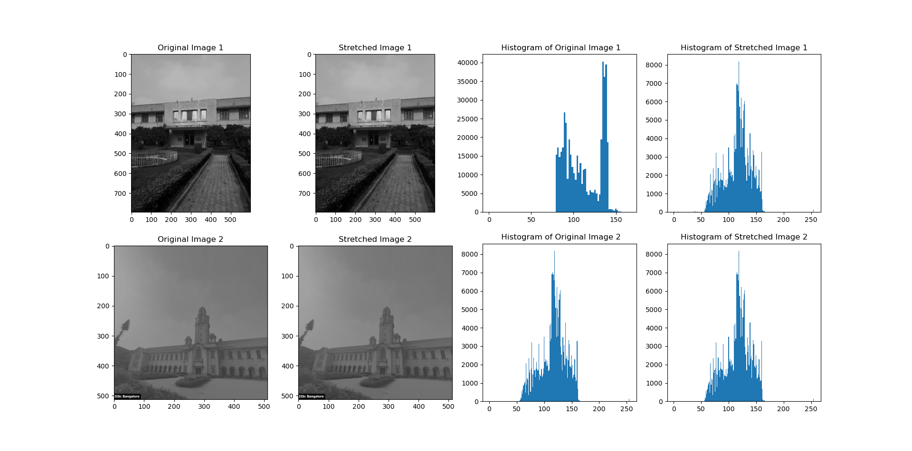

# Min Max Contrast Stretch Image
  Min-max contrast stretching is a simple image enhancement technique that increases the contrast of an image by stretching the pixel intensities to fill the entire range of possible values. This is done by finding the minimum and maximum pixel intensities in the image and then mapping all of the pixel values to a new range that starts at 0 and ends at 255.

